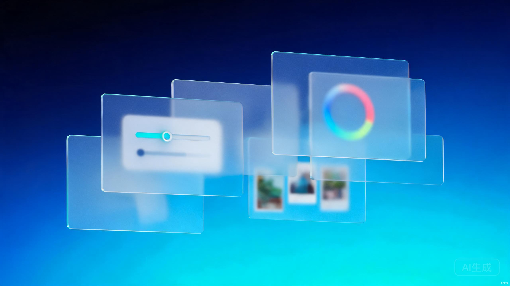
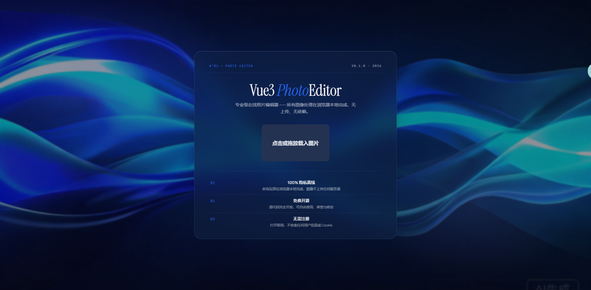
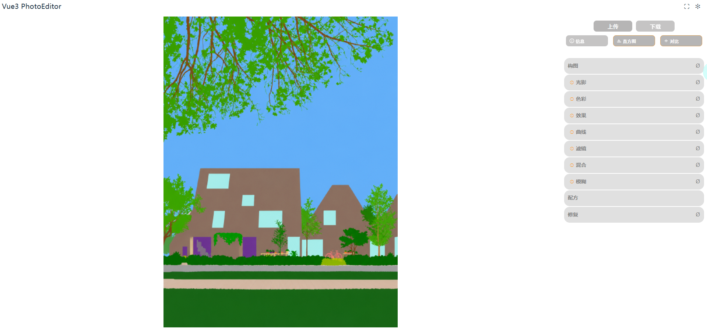
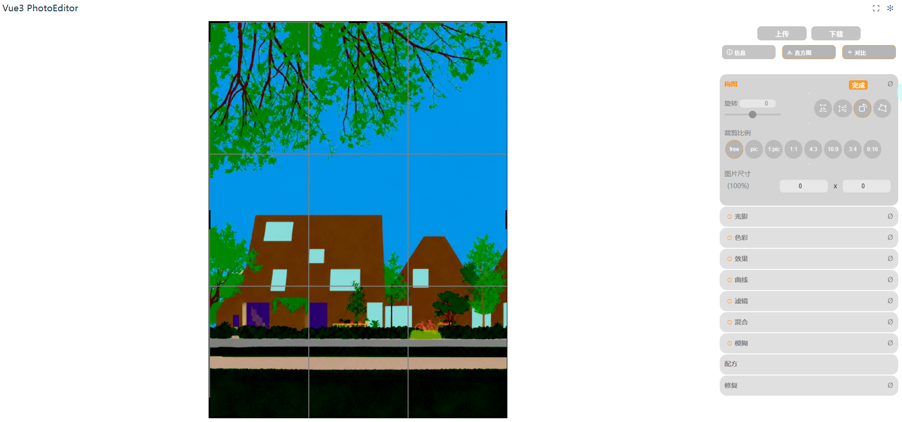

# Vue3 PhotoEditor




一个基于 **Vue 3 + WebGL** 的纯前端图片编辑器，所有图像处理均在浏览器本地完成，**100% 隐私、免费且开源**。

 

#### 功能特性

- **图片载入**：支持点击 / 拖放载入本地图片，也可通过 URL、Blob、ArrayBuffer 等方式打开，内置示例图片
- **构图**：旋转、左右翻转、90° 旋转、透视校正、裁剪（自由 / 原图比例 / 1:1 / 4:3 / 16:9 等）、图片尺寸调整
- **光影**：亮度、曝光、伽马、对比度、阴影、高光、泛光
- **色彩**：色温、色调、自然饱和度、饱和度、怀旧
- **效果**：清晰度、噪点、暗角
- **曲线**：可视化颜色曲线调节
- **滤镜**：13 款 Instagram 风格 LUT 滤镜（阿登、奶油、克拉伦登、方格、朱诺、云雀、月光、宝丽来、柯达等），支持混合强度
- **混合**：叠加另一张图片并调节混合比例
- **模糊**：散景模糊、高斯模糊，支持自定义模糊中心
- **修复**：基于 Telea 算法的图像修复（涂抹蒙版去除瑕疵）
- **配方**：将编辑参数保存 / 载入为 JSON 配方，一键复用
- **辅助工具**：直方图、原图对比（分割视图）、EXIF/TIFF 文件信息
- **导出**：JPEG / PNG 格式下载，可调质量，保留 EXIF 元数据；移动端支持系统分享
- **体验**：亮 / 暗 / 自动主题切换、全屏编辑、缩放平移、移动端适配

#### 软件架构

纯前端单页应用（SPA），无后端服务，图像处理完全基于 WebGL 在本地 GPU 上实时完成：

```
┌────────────────────────────────────────────────┐
│                    入口 (App.vue)              │
├────────────────────────────────────────────────┤
│                Editor.vue（主编辑器）          │
│   ├── 功能面板（构图 / 光影 / 色彩 / 效果 ...）│
│   ├── Canvas 编辑区（缩放、平移、透视、裁剪）  │
│   └── 直方图 / 分割视图 / 弹窗（下载、信息）   │
├────────────────────────────────────────────────┤
│         @xdadda/mini-gl（WebGL 滤镜管线）      │
│   LUT 滤镜 │ 曲线 │ 模糊 │ 透视 │ 混合 │ 调整  │
├────────────────────────────────────────────────┤
│    @xdadda/mini-exif（EXIF/TIFF 元数据读写）   │
│    js/inpaint.js（Telea 修复算法）             │
│    js/histogram_worker.js（直方图 Worker）     │
└────────────────────────────────────────────────┘
```

**技术栈**

| 技术 | 用途 |
| ---- | ---- |
| Vue 3（Composition API + `<script setup>`） | 前端框架 |
| Pinia | 状态管理（主题等全局状态） |
| Vite | 构建工具与开发服务器 |
| @xdadda/mini-gl | WebGL 图像滤镜渲染管线 |
| @xdadda/mini-exif | EXIF / TIFF 元数据解析与写入 |
| ismobilejs | 移动端设备识别 |
| Web Worker | 直方图并行计算（避免阻塞主线程） |

#### 安装教程

环境要求：Node.js 18+

```bash
# 1. 克隆仓库
git clone <本仓库地址>
cd vue3-img-editor

# 2. 安装依赖
npm install

# 3. 启动开发服务器（默认 http://localhost:3000）
npm run dev

# 4. 生产构建
npm run build

# 5. 本地预览构建产物
npm run serve
```

#### 使用说明

1. 打开首页后，**点击或拖放**图片到上传区域（或点击「示例图片」快速体验）
2. 图片载入后，点击侧边栏对应功能区块展开面板：
   - **构图**：旋转 / 翻转 / 透视校正 / 裁剪比例 / 图片尺寸
   - **光影 / 色彩 / 效果 / 曲线 / 滤镜 / 混合 / 模糊**：滑块或控件实时调节
   - **修复**：勾选开关后涂抹需要修复的区域
   - **配方**：保存当前参数为 `.json` 或载入已有配方
3. 顶栏可开启 **直方图**、**原图对比（分割视图）**，查看 **文件信息**（EXIF/TIFF）
4. 点击「下载」选择 JPEG / PNG 格式与质量即可导出，导出将保留原始 EXIF 信息
5. 支持缩放 / 平移画布，双击画布自动居中

> 所有操作均在本地浏览器完成，图片不会被上传到任何服务器。

#### 目录结构

```
├── public/
│   ├── icons/           # PWA 图标
│   └── samples/         # 示例图片
├── src/
│   ├── assets/          # 静态资源（LUT 滤镜图、SVG 图标等）
│   ├── components/      # Vue 组件（编辑面板、画布组件等）
│   ├── js/              # 工具与算法（inpaint 修复、缩放平移等）
│   ├── stores/          # Pinia 状态管理
│   ├── App.vue          # 根组件
│   └── main.js          # 入口文件
├── index.html
├── vite.config.js
└── package.json
```

#### 参与贡献

1. Fork 本仓库
2. 新建 Feat_xxx 分支
3. 提交代码
4. 新建 Pull Request

#### 致谢

本项目基于 [mini-photo-editor](https://github.com/xdadda/mini-photo-editor)（作者 xdadda，MIT 协议）进行 Vue 3 版本的重构与扩展，在此感谢原作者的开源贡献。


